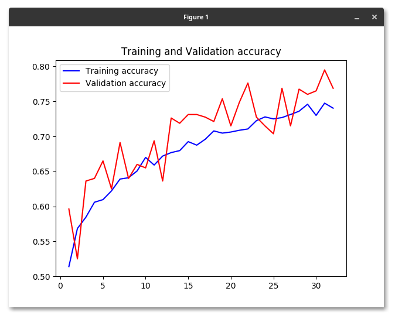
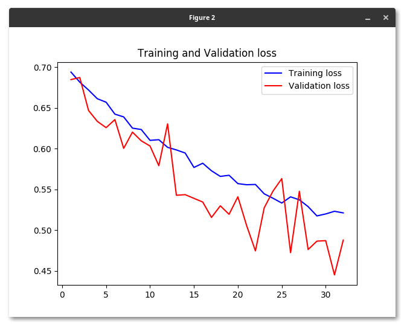
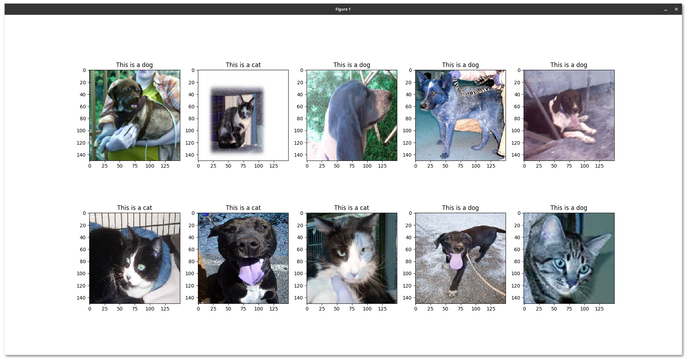

# Smart-squirrel
Convolutional neural network implementation for school project :

CNNs are made up of neurons that have learnable weights and biases. Each neuron receives  some  inputs,  performs  a  dot  product  and  optionally  follows  it  with  a  non-linearity. The whole network still expresses a single differentiable score function: from the raw image pixels on one end to class scores at the other. And they still have a loss function (e.g. SVM/Softmax) on the last (fully-connected) layer and all the tips/tricks we developed for learning regular Neural Networks still apply.

# Image classification from scratch

> We  propose  to  use an  existing  dataset  of  dogs  and  cats  available  on theKaggle platform: https://www.kaggle.com/c/dogs-vs-cats-redux-kernels-edition/data

__Used libairies :__
- `cv2` also calledOpenCV, is an image and video processing library available in Python and many other high level programming languages. It is used in reading and resizing Images.
- `Numpy`
- `Pandas`
- `Matplotlib`
- `gc`

# Getting started

1. Start by downloading dataset available on kaggle and extract it like below :
   - `data/train/`
   - `data/test/`
1. Create a virtual environment using `pipenv` with `pipenv install`
1. Execute `CNN_from_scratch.py` with the command `pipenv run python CNN_from_scratch.py`

You should obtain the following results :

